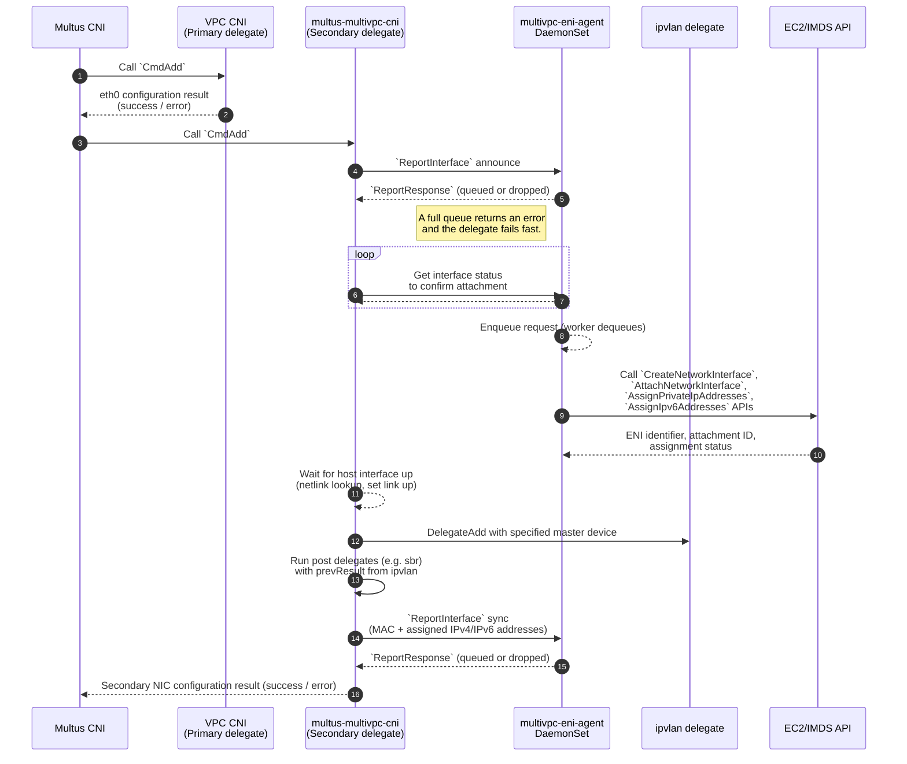
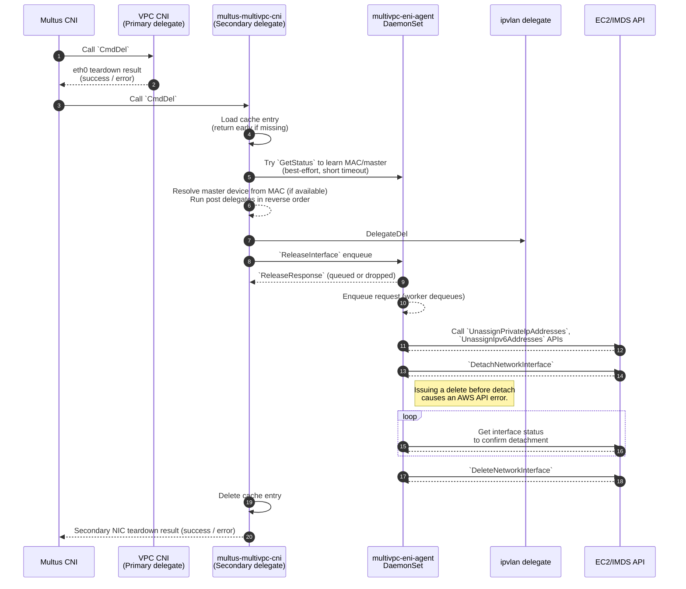

# multus-multivpc-cni

<!--[](https://github.com/soracom/multus-multivpc-cni/actions/workflows/go.yaml?query=branch%3Amain) [](https://github.com/soracom/multus-multivpc-cni/actions/workflows/docker.yaml?query=branch%3Amain) [](https://github.com/soracom/multus-multivpc-cni/actions/workflows/helm.yaml?query=branch%3Amain)-->

A Multus delegate CNI plugin that exposes [Multi-VPC ENI Attachments](https://aws.amazon.com/about-aws/whats-new/2023/10/multi-vpc-eni-attachments/) to Pods — keeping ENIs in other VPCs aligned with Pod lifecycle on each node dynamically provisioned via Karpenter or Cluster Autoscaler.

## Background and Motivation

**As of December 2025**, AWS official EKS plugins still lack support for Multi-VPC ENI Attachments.
Multus users must therefore choose between running an overlay network or attaching secondary CIDR blocks to the EKS VPC.
Overlay modes introduce encapsulation overhead and MTU management, while secondary CIDRs inherit AWS restrictions — for instance, a VPC whose primary block comes from a BYOIP range such as 198.18.0.0/15 cannot mix in RFC1918 ranges like 10.0.0.0/16 as secondary space.

To close this gap, this repository provides a Multus delegate CNI plugin with the following requirements:

- **Multi-VPC Pod networking:**
  Pods can join networks backed by subnets and security groups that reside in other VPCs by attaching *additional ENIs* as required (not limited to a single “secondary” ENI).
  This extends Amazon VPC CNI–based clusters with multi-VPC reachability while preserving the existing primary interface workflow and avoiding interference with the standard node-level ENI/IP allocation model.

- **Fully IPAM-agnostic:**
  Any Multus-compatible IPAM — static, [whereabouts](https://github.com/k8snetworkplumbingwg/whereabouts), or otherwise — assigns Pod IPs independently, and those assigned addresses are propagated onto the ENIs used for multi-VPC connectivity.
  This ensures IP management stays modular, pluggable, and aligned with upstream Multus conventions.

- **Node-local agent:**
  Inspired by the AWS sample project [aws-samples/eks-automated-ipmgmt-multus-pods](https://github.com/aws-samples/eks-automated-ipmgmt-multus-pods),
  this design moves all ENI lifecycle operations into a node-scoped DaemonSet (`multivpc-eni-agent`) rather than spawning per-Pod sidecar helpers.
  By centralizing AWS API interactions, it achieves more predictable rate-limit behavior, higher reliability, better auditability,
  and unified operational visibility — while eliminating the operational overhead of Pod-level AWS components.

- **Profile-driven network selection:**
  Define subnet and security group mappings through Helm values as reusable network profiles.
  Pods request placement into those networks through annotations, enabling controlled, declarative multi-network attachment across namespaces and workloads.

- **Helm-packaged distribution:**
  The [`charts/multus-multivpc-cni`](charts/multus-multivpc-cni/) package provides a unified and reproducible installation path for clusters adopting multi-VPC Pod networking.

- **Built-in observability:**
  The agent exports Prometheus metrics capturing attachment/release activity, latency, queueing, and error conditions. 

This CNI targets Telco environments where strict separation of network segments is required.

## Architecture

The CNI path keeps the primary VPC CNI as-is, then chains `multus-multivpc-cni`, which reports the Pod/profile to the node agent, waits for the attached ENI + MAC, runs the embedded `ipvlan` (and optional post delegates such as `sbr`), and finally syncs MAC/IPs back to the agent before returning success to Multus.

#### CmdAdd Flow



#### CmdDel Flow



### CNI Delegate

Multus invokes `multus-multivpc-cni` as a secondary delegate after the VPC CNI provisions `eth0`. The plugin:

- Resolves the network profile from Pod annotations.
- Announces the Pod/profile to the node agent, polls `GetStatus` until an ENI is attached and a MAC is available, then waits for the host interface with that MAC to appear.
- Runs an embedded `ipvlan` delegate (L2) with the ENI as master, followed by optional post delegates (for example, `sbr`), threading `prevResult` between delegates.
  `ipvlan` is chosen over `macvlan` because Amazon EKS does not support `macvlan` reliably on managed nodes; `ipvlan` is the recommended approach for additional interfaces.
- Collects MAC/IPs from the Pod netns, reports them back to the agent via `ReportInterface`, caches the state for `CmdDel`, and returns the chained CNI result to Multus.
- On `CmdDel`, reloads the cache (no-op if missing), optionally discovers the master by MAC, executes post delegates in reverse order then `ipvlan` DEL, enqueues `ReleaseInterface`, and removes the cache file.

### ENI Agent

A node-local daemon that turns delegate requests into ENI attach/detach work.
It listens on a Unix socket, queues requests (rejecting when full), and processes them asynchronously.

- For `CmdAdd`, it ensures an ENI exists and is attached with the requested addresses, then publishes the ENI/MAC in state so the delegate can poll `GetStatus`.
- For `CmdDel`, it unassigns addresses then detaches and deletes the ENI; a Pod watcher also enqueues releases when Pods terminate.
- Responses only reflect queue acceptance; the actual AWS operations run in the worker.
- Exposes Prometheus metrics for sync/release totals, failures, latency, queue depth, and in-flight operations.

>[!IMPORTANT]
> Karpenter-provisioned nodes must have network interface hotplug enabled; otherwise, ENIs attached by `multivpc-eni-agent` will not appear in the OS.
> Ensure your EC2NodeClass or AMI userdata enables hotplug (for example, Bottlerocket `settings.kubernetes.enable-network-interface-hotplug = true`, or equivalent systemd/udev configuration for AL/Ubuntu).

### Taint Controller (Optional)

Runs a simple reconcile loop that adds a “not ready for Multus” taint to nodes where the ENI agent Pod is not yet Running + Ready, and removes the taint once the agent is ready on that node.
This prevents secondary-network Pods from scheduling onto nodes that cannot yet attach secondary ENIs.

- Watches agent Pods on each node and builds a ready/unready map; no AWS calls are made.
- Periodically iterates over nodes and applies or removes the taint based on agent readiness.
  Nodes without a ready agent keep the taint; nodes with a ready agent have it cleared.
- Safe to use in dynamic environments (e.g., Karpenter); newly created nodes stay tainted until the agent Pod comes up locally.

## Installation

Deploy this plugin with Helm.
Keys under `networkProfiles` become profile identifiers referenced from Pod annotations.
Each entry maps logical names to the AWS subnet and security groups that should back the secondary ENI.

1. Copy defaults and add a network profile:
   ```bash
   cp charts/multus-multivpc-cni/values.yaml my-values.yaml
   cat <<'YAML' >> my-values.yaml
   networkProfiles:
     vpc-xxxx-subnet-yyyy:
       subnetId: subnet-1234567890abcdef
       securityGroupIds:
         - sg-1234567890abcdef
   YAML
   ```

2. Install/upgrade from local sources:
   ```bash
   helm upgrade --install multus-multivpc ./charts/multus-multivpc-cni -f my-values.yaml
   ```

### Network Attachment Definitions

Example using Whereabouts:

```yaml
apiVersion: k8s.cni.cncf.io/v1
kind: NetworkAttachmentDefinition
metadata:
  name: multus-vpc-xxxx-yyyy
  namespace: multus
  annotations:
    cni.soracom.io/multus-multivpc-profile: vpc-xxxx-subnet-yyyy
spec:
  config: |
    {
      "cniVersion": "1.1.0",
      "name": "multus-vpc-xxxx-yyyy",
      "type": "multus-multivpc-cni",
      "delegate": {
        "type": "ipvlan",
        "mode": "l2",
        "ipam": {
          "type": "whereabouts",
          "range": "172.16.0.0/24"
        }
      },
      "postDelegates": [
        { "type": "sbr" }
      ]
    }
```

Static IP assignment is also supported:

```yaml
apiVersion: k8s.cni.cncf.io/v1
kind: NetworkAttachmentDefinition
metadata:
  name: multus-vpc-xxxx-yyyy-static
  namespace: multus
  annotations:
    cni.soracom.io/multus-multivpc-profile: vpc-xxxx-subnet-yyyy
spec:
  config: |
    {
      "cniVersion": "1.1.0",
      "name": "multus-vpc-xxxx-yyyy-static",
      "type": "multus-multivpc-cni",
      "delegate": {
        "type": "ipvlan",
        "mode": "l2",
        "ipam": {
          "type": "static",
          "addresses": [
            { "address": "172.16.0.50/24", "gateway": "172.16.0.1" }
          ]
        }
      },
      "postDelegates": [
        { "type": "sbr" }
      ]
    }
```

>[!NOTE]
> The delegate expects Pods to declare the network profile via `cni.soracom.io/multus-multivpc-profile` by default.
> To follow a different naming convention, set `networkProfileAnnotation` in the delegate configuration ([`multus-multivpc-cni-configmap.yaml`](charts/multus-multivpc-cni/templates/multus-multivpc-cni-configmap.yaml)) and update your NADs accordingly.
> You can also override the profile per invocation via `networkProfileArg` or fall back to `networkProfileDefault`.

## Development Workflow

Implementation notes, workflows, and developer guidance are documented in [CONTRIBUTING.md](CONTRIBUTING.md).

## License

This software is available under the [MIT](LICENSE). External contributions are not accepted for this repository.
